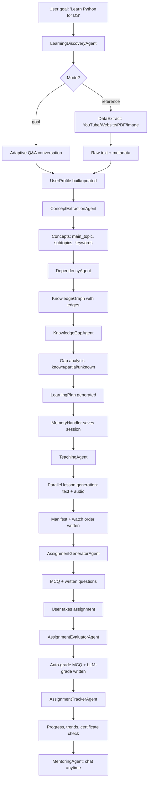

# 📘 Jinvexa — How It Works: Core Principles & Data Flow Architecture

> A human-friendly, detailed walkthrough of how the Jinvexa Learning AI thinks, remembers, teaches, tests, and mentors.

---

## Table of Contents

1. [What Is Jinvexa?](#1-what-is-jinvexa)
2. [Core Principles](#2-core-principles)
3. [The Five-Layer Architecture](#3-the-five-layer-architecture)
4. [The Brain: Ollama LLM Client](#4-the-brain-ollama-llm-client)
5. [The Agent System](#5-the-agent-system)
6. [Data Models: The Shape of Knowledge](#6-data-models-the-shape-of-knowledge)
7. [Memory & Persistence](#7-memory--persistence)
8. [End-to-End Data Flow](#8-end-to-end-data-flow)
9. [Layer-by-Layer Deep Dive](#9-layer-by-layer-deep-dive)
10. [File System Layout](#10-file-system-layout)
11. [Concurrency & Performance](#11-concurrency--performance)
12. [Configuration](#12-configuration)
13. [Glossary](#13-glossary)

---

## 1. What Is Jinvexa?

Jinvexa is an **AI-powered personalized learning platform**. Instead of handing you a list of links or a generic syllabus, it builds a *custom university* around you — shaped by your goals, what you already know, and how you prefer to learn.

Think of it as a tiny school staffed entirely by AI agents:

- A **librarian** who reads any source you give it (YouTube, websites, PDFs, images).
- A **counselor** who asks you questions to understand where you are and where you want to go.
- A **curriculum designer** who maps out what concepts depend on what, and figures out your gaps.
- A **teacher** who writes full lessons (text + audio) and organizes them into a watchable course.
- An **examiner** who creates assignments, grades them, and tracks your progress.
- A **mentor** you can chat with anytime, who remembers your whole learning journey.

All of these "staff members" are Python classes called **agents**, and they all share a single AI brain powered by a local **Ollama** LLM.

---

## 2. Core Principles

Jinvexa is built on a handful of ideas that show up everywhere in the code:

### 🧩 Single-Brain, Many-Agents
There is **one LLM client** (`OllamaLLMClient` in `app.py`) that every agent shares. No agent talks to Ollama directly — they all go through this shared client. This keeps configuration, error handling, and JSON parsing in one place.

### 🎯 Separation of Concerns via Layers
The system is split into five layers, each with a clear job:
**Input → Planning → Teaching → Assessment → Mentoring.**
Each layer only does its thing and hands results to the next.

### 🧠 Stateful Memory
Nothing is forgotten between runs. A `MemoryHandler` persists every session, profile, and conversation to disk (JSON files + a SQLite DB for mentoring). This is what lets you pause a course, come back tomorrow, and pick up exactly where you left off.

### 📊 Confidence-Based Knowledge Modeling
Your knowledge isn't "known" or "unknown" — it's a **confidence score from 0.0 to 1.0** per concept. This lets the system distinguish "I've heard of it" (0.3) from "I can teach it" (0.9), which makes gap analysis far more nuanced than a simple checklist.

### 🔗 Dependency-Aware Planning
Concepts aren't a flat list — they form a **knowledge graph** where some concepts depend on others. The planner walks this graph to put lessons in the right order, so you never learn "neural networks" before "linear algebra."

### 🛡️ Graceful Degradation
Every agent has a fallback. If the LLM fails to return JSON, a regex-based extractor kicks in. If LLM assignment configuration fails, a rule-based fallback sizes the quiz. The app keeps working even when the brain hiccups.

### ⚡ Parallel Where It Matters
Lesson generation is the slowest step, so it's parallelized with a `ThreadPoolExecutor` (5 workers). Ten lessons that would take 10× sequentially finish in ~2× wall-clock time.

---

## 3. The Five-Layer Architecture

```
┌─────────────────────────────────────────────────────────────┐
│                        app.py (JinvexaApp)                   │
│                   The orchestrator / menu                    │
└──────────────────────────┬──────────────────────────────────┘
                           │
   ┌───────────────────────┼───────────────────────┐
   ▼                       ▼                       ▼
┌─────────┐  ┌───────────────────────┐  ┌──────────────────┐
│ Layer 1 │  │       Layer 2         │  │     Layer 3      │
│  Input  │→ │      Planning         │→ │     Teaching     │
│(Extract)│  │ (Discover & Plan)     │  │  (Generate Course)│
└─────────┘  └───────────────────────┘  └────────┬─────────┘
                                                 │
                           ┌─────────────────────┼─────────────┐
                           ▼                                   ▼
                    ┌──────────────┐                    ┌──────────────┐
                    │   Layer 4    │                    │   Layer 5    │
                    │ Assessment   │                    │  Mentoring   │
                    │(Test & Grade)│                    │   (Chat)     │
                    └──────────────┘                    └──────────────┘
```

| Layer | Purpose | Key Agents | Output |
|-------|---------|-----------|--------|
| **1. Input** | Ingest raw content from any source | `DataExtract` (+ YouTube, Website, Document, Image parsers) | Raw text + metadata |
| **2. Planning** | Understand content & learner, build a roadmap | `ConceptExtractionAgent`, `DependencyAgent`, `KnowledgeGapAgent`, `LearningDiscoveryAgent` | A `LearningPlan` |
| **3. Teaching** | Turn the plan into a full course | `TeachingAgent` (+ `TextToSpeech`) | Lesson `.txt` files, `.mp3` audio, manifest JSON |
| **4. Assessment** | Create, grade, and track assignments | `AssignmentGeneratorAgent`, `AssignmentEvaluatorAgent`, `AssignmentTrackerAgent` | Assignment JSONs, results, progress reports |
| **5. Mentoring** | Conversational guidance | `MentoringAgent` | SQLite-stored chat history |

All layers read from and write to the **MemoryHandler**, which is the shared backbone.

---

## 4. The Brain: Ollama LLM Client

Defined at the top of `app.py`, `OllamaLLMClient` is the single point of contact with the LLM.

```python
class OllamaLLMClient:
    async def complete(prompt, system_prompt=None) -> str
    async def complete_with_json(prompt, system_prompt=None) -> dict
```

**How it works:**
1. Builds a `messages` list (optional system prompt + user prompt).
2. Calls `ollama.chat(...)` wrapped in `asyncio.to_thread(...)` so the blocking HTTP call doesn't freeze the async event loop.
3. Uses `temperature=0.3` (low creativity, high consistency) and `num_predict=2000` (long outputs for lessons).
4. `complete_with_json` runs a regex `\{.*\}` over the response to pull out a JSON object — this is how agents get structured data back from the model.

**Why this matters:** Because every agent receives the *same* `llm_client` instance in its constructor, swapping models (e.g., from `gemma4:31b-cloud` to `llama3`) is a one-line change in `.env`, and every agent instantly uses the new brain.

---

## 5. The Agent System

### The Contract: `BaseAgent`

Every agent inherits from `BaseAgent` (`Agents/BaseAgent.py`), which enforces a single contract:

```python
class BaseAgent(ABC):
    async def process(input_data: Dict) -> Dict  # abstract — must implement
```

This means **every agent is a function that takes a dict and returns a dict**. That uniformity is what lets `app.py` orchestrate them generically.

### The Agents at a Glance

| Agent | File | Role |
|-------|------|------|
| `LearningDiscoveryAgent` | `Agents/LearningDiscoveryAgent.py` | The conductor of Layer 2 — runs the discovery conversation and assembles the plan |
| `ConceptExtractionAgent` | `Agents/ConceptExtractionAgent.py` | Pulls topics/subtopics/keywords out of raw text (LLM-first, regex fallback) |
| `DependencyAgent` | `Agents/DependencyAgent.py` | Builds a `KnowledgeGraph` of what depends on what |
| `KnowledgeGapAgent` | `Agents/KnowledgeGapAgent.py` | Compares your `UserProfile` against the graph to find gaps |
| `TeachingAgent` | `Agents/TeachingAgent.py` | Generates lessons (text + audio) in parallel, writes a manifest |
| `AssignmentGeneratorAgent` | `Agents/AssignmentGeneratorAgent.py` | Auto-configures and creates MCQ + written questions |
| `AssignmentEvaluatorAgent` | `Agents/AssignmentEvaluatorAgent.py` | Auto-grades MCQ; LLM-grades written answers; produces feedback |
| `AssignmentTrackerAgent` | `Agents/AssignmentTrackerAgent.py` | Aggregates scores, trends, weak areas, certificate eligibility |
| `MentoringAgent` | `Agents/MentoringAgent.py` | SQLite-backed chatbot with session/full modes and garbage collection |

---

## 6. Data Models: The Shape of Knowledge

These dataclasses (`Models/`) are the **lingua franca** that flows between agents.

### `UserProfile` (`Models/UserProfile.py`)
Your personal knowledge fingerprint:
- `known_concepts: Dict[concept → {confidence, evidence, last_updated}]`
- `goals`, `preferred_depth`, `learning_pace`, `learning_history`
- Key methods: `add_knowledge()`, `get_confidence()`, `is_concept_known(threshold=0.6)`, `get_weak_concepts()`

> The confidence thresholds are used everywhere: **≥0.7 = known**, **0.3–0.7 = partial**, **<0.3 = gap**.

### `KnowledgeGraph` & `KnowledgeNode` (`Models/KnowledgeGraph.py`)
A directed graph of concepts:
- `nodes: Dict[id → KnowledgeNode]`
- `adjacency: Dict[from → {to, ...}]` (concept *depends on* these)
- `reverse_adjacency`: who depends on *me*
- `get_learning_path(target)`: a **DFS topological sort** that returns prerequisites-first ordering — this is the algorithm that decides lesson sequence.

### `LearningPlan` & `LearningPhase` (`Models/LearningPlan.py`)
The final roadmap produced by Layer 2:
- `main_topic`, `goal`, `goal_type` (understand/build/interview/research/teach/certification)
- `current_level`, `strengths`, `knowledge_gaps`
- `roadmap: List[LearningPhase]` — each phase has topics, estimated hours, projects, prerequisites
- `projects`, `quizzes`, `resources`, `confidence_scores`
- Has `to_dict()`, `from_dict()`, and `to_markdown()` for human-readable output.

---

## 7. Memory & Persistence

### `MemoryHandler` (`Agents/MemoryHandler.py`)

The central nervous system. It stores everything under `memory_storage/`:

```
memory_storage/
├── profiles/      ← UserProfile JSONs (1.json, 2.json, ...)
└── sessions/      ← SessionMemory JSONs (one per learning session)
```

**`SessionMemory`** is a dataclass capturing the *entire state* of one learning session:
- `session_id`, `user_id`, `mode` (goal/reference)
- `conversation_history`, `extracted_data`, `concepts`
- `knowledge_graph`, `gap_analysis`, `learning_plan`, `user_profile`

**Session IDs** are deterministic and unique:
`{user_id}_{YYYYMMDD_HHMMSS}_{8-char-md5-hash}` — e.g. `1_20260718_002652_d4f1434b`.

The handler keeps an **in-memory cache** (`_cache`, `_profile_cache`) for fast repeated access, and writes through to disk on every change.

### Mentoring Memory (SQLite)

`MentoringAgent` uses a separate SQLite DB at `learn_files/mentoring/mentoring_memory.db` because chat history is high-volume and benefits from real querying. It auto-runs **garbage collection**: conversations older than 7 days are purged, and overly long conversations are truncated to `max_messages_per_session` (default 50).

---

## 8. End-to-End Data Flow

Here's what happens when a user says **"I want to learn Python for data science"** and runs through the full pipeline:



### Step-by-step narrative

1. **You state a goal.** `app.py` calls `LearningDiscoveryAgent.process({mode: "goal", goal: "...", user_id})`.
2. **The agent asks you questions** (adaptive templates — general, python-specific, statistics, etc.) to gauge your level. Your answers update your `UserProfile` confidence scores.
3. **Concepts are extracted** from your goal text (or from a reference source you provided) by `ConceptExtractionAgent`. Output: `{main_topic, subtopics, domain, difficulty, keywords, prerequisites, related_topics}`.
4. **Dependencies are mapped.** `DependencyAgent` turns the flat concept list into a `KnowledgeGraph`, recursively adding prerequisite edges (e.g., "Neural Networks" → "Linear Algebra" → "Basic Math").
5. **Gaps are identified.** `KnowledgeGapAgent` overlays your `UserProfile` onto the graph. Each required concept is bucketed into **known / partially known / unknown**, with an estimated learning time per gap.
6. **A `LearningPlan` is born.** The discovery agent assembles phases, projects, quizzes, and resources into a structured roadmap and saves the whole session (conversation + plan + graph + profile) via `MemoryHandler`.
7. **You pick "Teaching Layer" from the menu.** `TeachingAgent` loads the session's plan and, for each topic, asks the LLM to decide the format (text / female audio / male audio). It then spins up to 5 parallel threads to generate lessons. Text lessons are saved as `.txt`; audio lessons are synthesized via `edge-tts` and saved as `.mp3`. A JSON **manifest** and a human-readable **watch order** are written to `learn_files/manifests/`.
8. **You take an assignment.** `AssignmentGeneratorAgent` reads the manifest + lesson files, asks the LLM to auto-configure question counts/difficulty/passing score based on course complexity and your profile, then generates MCQs (with explanations) and written questions (with rubrics).
9. **You submit answers.** `AssignmentEvaluatorAgent` instantly grades MCQs by index comparison, and sends written answers to the LLM for rubric-based scoring with feedback. A result JSON is saved to `learn_files/assignments/results/`.
10. **Progress is tracked.** `AssignmentTrackerAgent` aggregates all your results: average/best/latest scores, performance trend (improving/consistent/needs attention), weak areas, and **certificate eligibility** (3+ assignments with 70%+ average).
11. **You chat with the mentor.** `MentoringAgent` loads either one session's content (session mode) or all your sessions (full mode) as context, and answers your questions with references to actual course material. Every message is stored in SQLite so you can resume later.

---

## 9. Layer-by-Layer Deep Dive

### Layer 1 — Input (`DataHandle/Utils/`)

`DataExtract` (`DataExtractor.py`) is a smart router. Given any source string, it figures out the type and delegates:

| Source type | Detector | Parser | Output |
|-------------|----------|--------|--------|
| YouTube URL | `_is_youtube()` checks hosts | `YouTubeTranscript` | `full_text`, `video_id`, language, segments |
| Other URL | `_is_url()` via `urlparse` | `WebsiteParser` (Playwright + BeautifulSoup + trafilatura) | Cleaned article text |
| PDF / DOCX | File extension | `DocumentParser` (PyMuPDF, python-docx) | Extracted text |
| Image | File extension | `ImageToText` (uses the LLM for OCR) | Recognized text |

If a YouTube video has no transcript, it returns a graceful error message instead of crashing.

### Layer 2 — Planning

This is the most intellectually dense layer. Four agents collaborate:

**`ConceptExtractionAgent`** — LLM-first with regex fallback. If the LLM call fails or returns non-JSON, it falls back to capitalised-word regex extraction filtered against a stop-word list. This guarantees *some* output always.

**`DependencyAgent`** — Maintains a `known_dependencies` dictionary for common topics (fast path), and queries the LLM for unknown concepts. It recursively expands prerequisites up to two levels deep, building a rich graph.

**`KnowledgeGapAgent`** — The heart of personalization. For every node in the graph, it reads your confidence from `UserProfile`:
- `confidence ≥ 0.7` → **known** (skip or review)
- `0.3 ≤ confidence < 0.7` → **partially known** (deepen)
- `confidence < 0.3` → **unknown** (learn from scratch, with estimated hours)

**`LearningDiscoveryAgent`** — The conductor. It runs the adaptive Q&A, then chains the three agents above, then asks the LLM to synthesize everything into a `LearningPlan`. It supports two modes:
- **Goal mode**: you describe what you want to achieve.
- **Reference mode**: you provide a source (URL/file) and it reverse-engineers a plan from the content.

### Layer 3 — Teaching

`TeachingAgent` is where the plan becomes a tangible course.

**Format selection:** For each topic, the LLM is prompted to choose:
- **Text** — for dense, reference-heavy content.
- **Female voice audio** — for warm, beginner-friendly topics.
- **Male voice audio** — for professional, advanced topics.

**Parallelism:** A `ThreadPoolExecutor(max_workers=5)` submits all lesson-generation tasks at once. A `threading.Lock` protects the shared `generated_content` dict. Results are collected via `as_completed`.

**TTS:** `output/tts.py` wraps `edge-tts` with two neural voices (`en-US-AvaMultilingualNeural` for female, `en-US-AndrewMultilingualNeural` for male). Text is preprocessed to insert natural pauses (newlines after `.`, `?`, `!`), and rate/pitch/volume are tuned for a teaching cadence.

**Outputs:**
```
learn_files/
├── lessons/    *.txt   (markdown-formatted lessons)
├── audio/      *.mp3   (TTS audio)
└── manifests/  *_manifest.json   (machine-readable watch order)
                *_watch_order.txt  (human-readable playlist)
```

The manifest includes, per item: file path, content type (text/audio), format reason, and topic — enabling a "playlist" experience.

### Layer 4 — Assessment

Three agents form a mini assessment engine:

**`AssignmentGeneratorAgent`** — Reads the manifest to get all lessons, then asks the LLM to **auto-configure**:
- MCQ count: 3–10 (scaled by course complexity)
- Written count: 1–4
- Difficulty: beginner / intermediate / advanced
- Passing score: 60–80%

If the LLM config fails, a **rule-based fallback** sizes the quiz from lesson count and content length. Questions include topic tags, explanations (MCQ), and scoring rubrics (written).

**`AssignmentEvaluatorAgent`** — Splits grading by type:
- **MCQ**: instant, deterministic — compares your answer index to the correct index.
- **Written**: sent to the LLM with the rubric; returns a score and qualitative feedback.

It then computes `total_score`, `max_score`, and a `grade`, and writes a result JSON.

**`AssignmentTrackerAgent`** — The analytics layer. Across all your results it computes:
- Average, best, latest scores
- Performance **trend** (improving / consistent / needs attention)
- **Weak areas** (topics where you consistently score low)
- **Certificate eligibility**: 3+ assignments completed with ≥70% average

### Layer 5 — Mentoring

`MentoringAgent` is a persistent chatbot with two modes:

- **Session mode**: context = one course's lessons + plan + your progress.
- **Full mode**: context = *all* your sessions — the mentor sees your entire learning journey.

**Storage:** SQLite (`mentoring_memory.db`) with tables for conversations and messages. Chosen over JSON because chat history is append-heavy and benefits from indexed queries.

**Lifecycle management:**
- **Garbage collection**: conversations older than `max_conversation_age_days` (7) are deleted on startup.
- **Truncation**: conversations exceeding `max_messages_per_session` (50) are trimmed to keep context windows manageable.

**Interactive commands** inside a chat: `quit`, `clear` (reset history), `summary` (stats).

---

## 10. File System Layout

```
Jinvexa/
├── app.py                      ← Entry point + JinvexaApp orchestrator + OllamaLLMClient
├── main.py                     ← Alternate entry (copy of `app.py`)
├── try.py                      ← Scratch/experimentation
├── requirements.txt
├── .env                        ← OLLAMA_MODEL, STORAGE_DIR, STORAGE_TYPE
│
├── Agents/                     ← All AI agents (one per file)
│   ├── BaseAgent.py            ← Abstract contract
│   ├── LearningDiscoveryAgent.py
│   ├── ConceptExtractionAgent.py
│   ├── DependencyAgent.py
│   ├── KnowledgeGapAgent.py
│   ├── TeachingAgent.py
│   ├── AssignmentGeneratorAgent.py
│   ├── AssignmentEvaluatorAgent.py
│   ├── AssignmentTrackerAgent.py
│   ├── MentoringAgent.py
│   └── MemoryHandler.py        ← Persistent storage backbone
│
├── Models/                     ← Dataclasses that flow between agents
│   ├── UserProfile.py
│   ├── LearningPlan.py
│   └── KnowledgeGraph.py
│
├── DataHandle/Utils/           ← Layer 1 input parsers
│   ├── DataExtractor.py        ← Router
│   ├── YouTubeTranscript.py
│   ├── WebsiteParser.py
│   ├── DocumentParser.py
│   └── ImageToText.py
│
├── Prompts/
│   └── conversation_prompts.py ← Prompt templates
│
├── Config/
│   └── Config.py               ← Centralized config
│
├── output/
│   └── tts.py                  ← edge-tts wrapper
│
├── memory_storage/             ← Persistent state (created at runtime)
│   ├── profiles/               ← UserProfile JSONs
│   └── sessions/               ← SessionMemory JSONs
│
├── learn_files/                ← Generated learning content (created at runtime)
│   ├── lessons/                ← Text lessons
│   ├── audio/                  ← Audio lessons + metadata
│   ├── manifests/              ← Course manifests + watch orders
│   ├── assignments/
│   │   ├── sessions/           ← Generated assignment JSONs
│   │   ├── results/            ← Graded results
│   │   ├── progress/           ← Progress summaries
│   │   └── templates/
│   └── mentoring/
│       └── mentoring_memory.db ← SQLite chat history
│
└── profiles/                   ← Legacy/alternate profile storage
```

---

## 11. Concurrency & Performance

| Mechanism | Where | Why |
|-----------|-------|-----|
| `asyncio.to_thread(ollama.chat)` | `OllamaLLMClient.complete` | The Ollama HTTP call is blocking; wrapping it keeps the async event loop responsive. |
| `async/await` throughout | All agent `process()` methods | Enables non-blocking composition of agents. |
| `ThreadPoolExecutor(max_workers=5)` | `TeachingAgent` | Lesson generation is the slowest step; parallelizing 5 at a time gives ~5× speedup for large courses. |
| `threading.Lock` | `TeachingAgent._lock` | Protects the shared `generated_content` dict during parallel writes. |
| In-memory caches | `MemoryHandler._cache` | Avoids re-reading JSON from disk on every access within a session. |
| SQLite for chat | `MentoringAgent` | Chat is append-heavy and query-heavy; SQLite indexes beat flat JSON here. |

---

## 12. Configuration

All runtime config lives in `.env`, loaded by `python-dotenv`:

| Variable | Default | Meaning |
|----------|---------|---------|
| `OLLAMA_MODEL` | `gemma4:31b-cloud` | Which local Ollama model powers every agent |
| `STORAGE_DIR` | `memory_storage` | Where session/profile JSONs are kept |
| `STORAGE_TYPE` | `json` | Storage backend (currently JSON only) |

LLM call parameters are hardcoded in `OllamaLLMClient`:
- `temperature: 0.3` — low randomness for consistent, structured output.
- `num_predict: 2000` — generous output length for full lessons.

Mentoring limits are configurable via `MentoringAgent`'s `config` dict:
- `max_history_tokens: 4000`
- `max_conversation_age_days: 7`
- `max_messages_per_session: 50`

---

## 13. Glossary

| Term | Meaning |
|------|---------|
| **Agent** | A Python class extending `BaseAgent` that does one job and returns a dict. |
| **Session** | One learning journey — from goal/reference to a saved `LearningPlan`. Has a unique ID. |
| **Knowledge Graph** | A directed graph where edges mean "depends on"; used to order lessons. |
| **Confidence Score** | A 0.0–1.0 value per concept in your `UserProfile` indicating how well you know it. |
| **Gap** | A required concept your confidence is below 0.3 for. |
| **Manifest** | A JSON file listing every generated lesson in watch order, with types and reasons. |
| **Watch Order** | A human-readable `.txt` version of the manifest — your playlist. |
| **Phase** | A group of related topics in a `LearningPlan` with its own estimated hours and projects. |
| **Ollama** | A local LLM runtime; Jinvexa talks to it via the `ollama` Python package. |
| **edge-tts** | Microsoft's free neural TTS; used to generate audio lessons. |

---

*This document describes the architecture as implemented in the current codebase. For the user-facing quick start, see `README.md`.*
